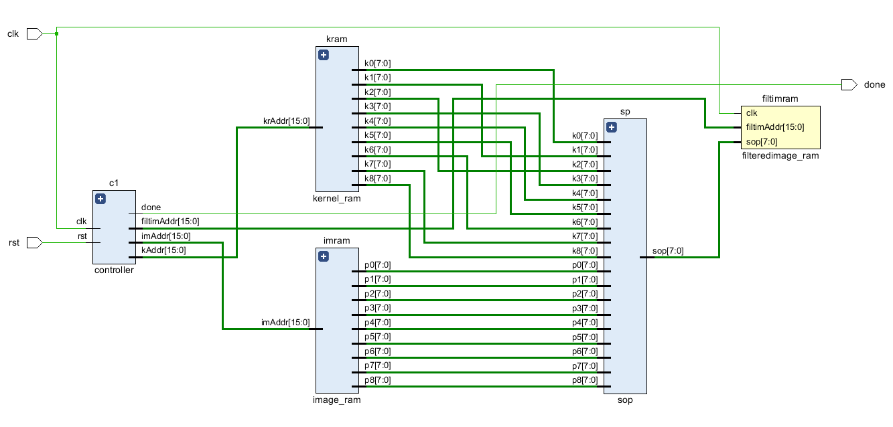

# Convolutional-Filters-HDL
This an HDL implementation of convolutional filteration of grayscale images with kernels of different sizes. Currently supports only fixed point arithmetic.

## Block Diagram

